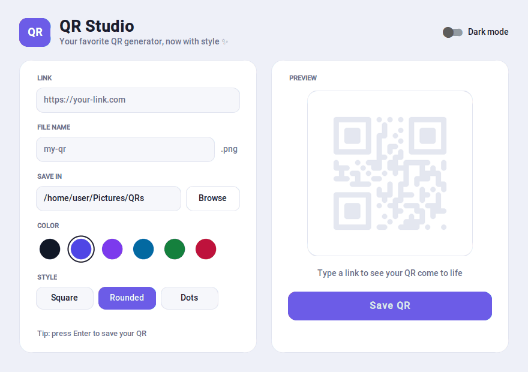
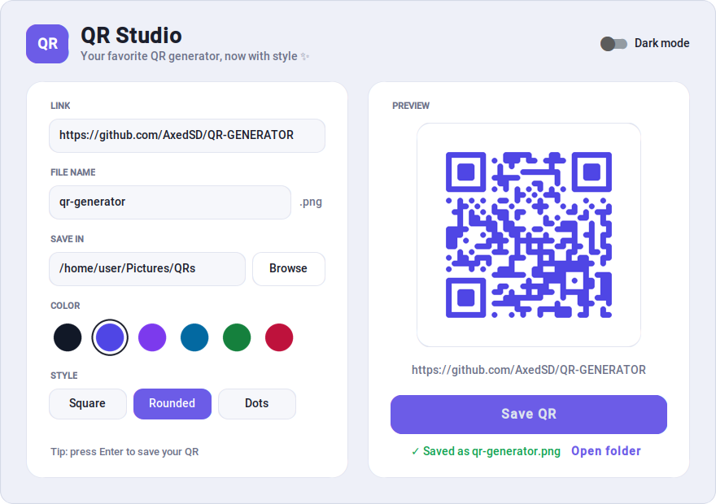
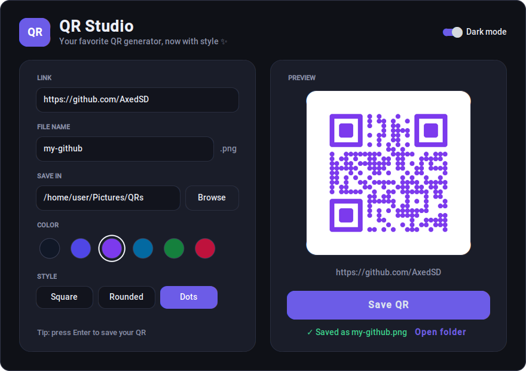

<div align="center">

# QR Studio

**Convierte cualquier link en un código QR con estilo: una app de escritorio hecha con Python.**


[English](README.md) · **Español**



</div>

## ✨ Funciones

- **Vista previa en vivo**: el QR se actualiza mientras escribes el link.
- **6 colores y 3 estilos**: cuadrado, redondeado o de puntos. Los colores son oscuros a propósito, para que los celulares puedan leer el QR.
- **Modo claro y oscuro**: empieza igual que tu computadora y se cambia con un clic.
- **Errores amigables**: el campo con el problema se pone rojo y un mensaje te dice qué corregir. Sin ventanas emergentes molestas.
- **Guardado seguro**: te pregunta antes de reemplazar un QR que tenga el mismo nombre.
- **Abrir carpeta**: después de guardar, un clic abre la carpeta con tu nuevo QR.

## 🎨 Estilos

| Cuadrado (Square) | Redondeado (Rounded) | Puntos (Dots) |
| :---: | :---: | :---: |
|  |  |  |

> 📱 ¡Escanéalos! Los tres abren este repositorio.

## 🌗 Modo claro y oscuro

| Claro | Oscuro |
| :---: | :---: |
|  |  |

## 🚀 Cómo empezar

Necesitas **Python 3.9 o más reciente** ([descárgalo aquí](https://www.python.org/downloads/)).

1. Descarga el proyecto:
   ```bash
   git clone https://github.com/AxedSD/QR-GENERATOR.git
   cd QR-GENERATOR
   ```
2. Instala las librerías que usa:
   ```bash
   python -m pip install -r requirements.txt
   ```
3. Abre la app:
   ```bash
   python qr_gui.py
   ```

> **Consejo:** en macOS y Linux quizás tengas que escribir `python3` en vez de `python`. En Linux, si ves `No module named 'tkinter'`, instálalo con `sudo apt install python3-tk`.

### Cómo se usa

1. Pega un link en **LINK**.
2. Elige un color (**COLOR**) y un estilo (**STYLE**). La vista previa cambia al instante.
3. Ponle un nombre a tu QR (**FILE NAME**) y elige dónde guardarlo (**SAVE IN**).
4. Pulsa **Save QR** (o <kbd>Enter</kbd>). Tu QR se guarda como una imagen `.png`.

## 💻 La versión original de terminal

Este proyecto empezó como un programa que funciona en la terminal: [`codedexfinal.py`](codedexfinal.py). Sigue aquí y sigue funcionando:

```bash
python codedexfinal.py
```

Te pide el nombre de una carpeta. Después, por cada link que escribes, te pide un nombre y guarda un QR en blanco y negro (escribe `0` para terminar).

## 📁 Estructura del proyecto

```
QR-GENERATOR/
├── qr_gui.py          # QR Studio, la app con ventanas y botones
├── codedexfinal.py    # La versión original de terminal
├── requirements.txt   # Librerías que hay que instalar
├── README.md          # Esta página (inglés)
├── README.es.md       # Esta página (español)
└── docs/              # Imágenes del README
```

## 🛠️ Hecho con

- [Python](https://www.python.org/)
- [CustomTkinter](https://github.com/TomSchimansky/CustomTkinter): ventanas y botones con un look moderno
- [qrcode](https://github.com/lincolnloop/python-qrcode): crea los códigos QR
- [Pillow](https://python-pillow.org/): trabaja con las imágenes

## 👋 Sobre el proyecto

Este fue mi primer proyecto de Python 🐍. Empezó como un pequeño programa de terminal y creció hasta convertirse en una app de escritorio completa.

Hecho por [@AxedSD](https://github.com/AxedSD).
